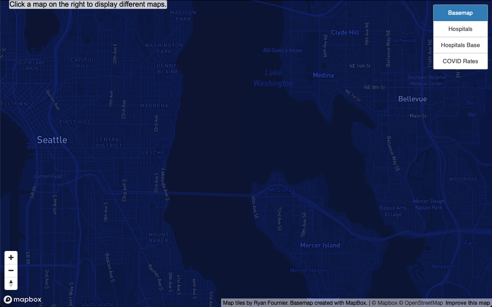
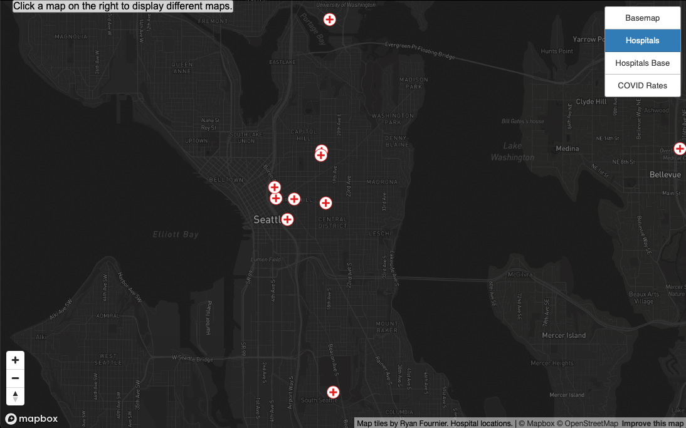
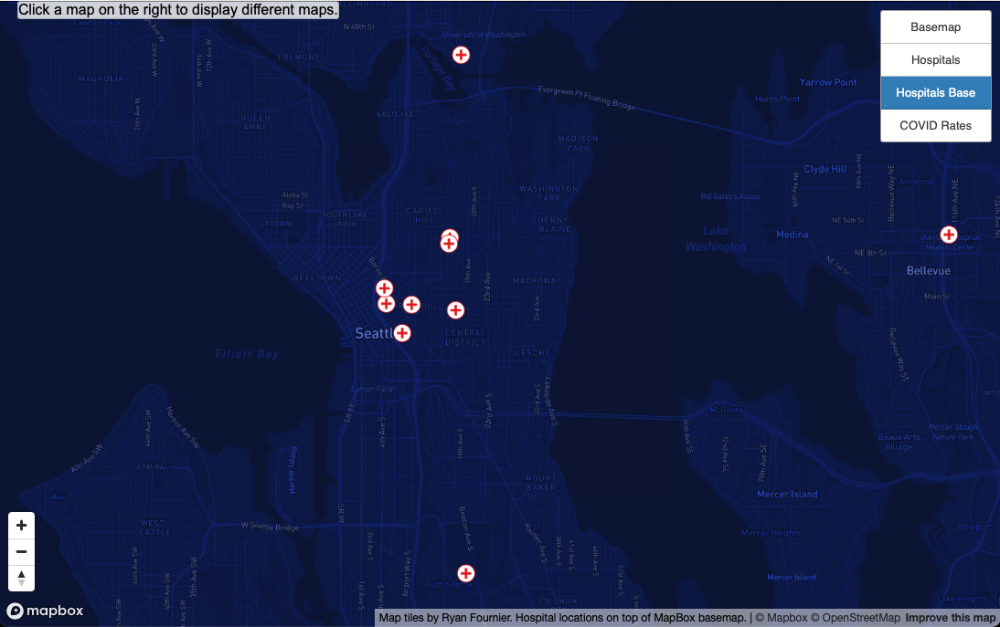
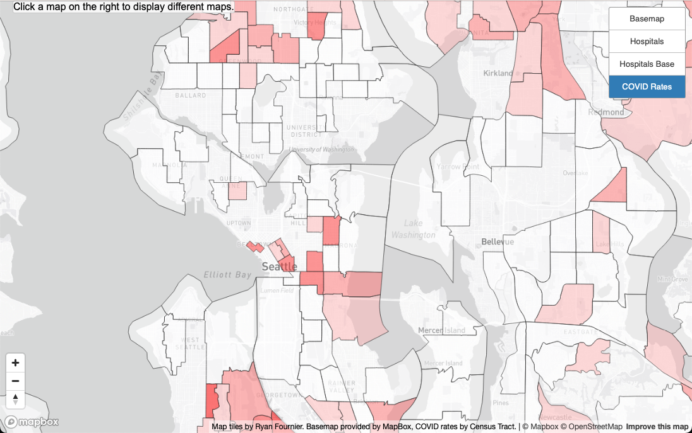

# Map Tiles Lab 4
## Ryan Fournier

Map URL: [https://4nierr.github.io/MapTilesLab/](https://4nierr.github.io/MapTilesLab/)

## Map 1 - Basemap

The examined geopgraphic area is of the greater Seattle region including central Seattle, parts of north and south Seattle, along with parts of Bellevue.

Available zoom levels: Max Zoom - 13; Min Zoom - 8

This map is a basic basemap layer with modified fonts and colors that was created using MapBox Studio.

## Map 2 - Hospitals

The examined geopgraphic area is of the greater Seattle region including central Seattle, parts of north and south Seattle, along with parts of Bellevue.

Available zoom levels: Max Zoom - 13; Min Zoom - 8

This map shows hospital locations throughout the region.

## Map 3 - Hospitals with Basemap

The examined geopgraphic area is of the greater Seattle region including central Seattle, parts of north and south Seattle, along with parts of Bellevue.

Available zoom levels: Max Zoom - 13; Min Zoom - 8

This map shows hospital on top of the first basemap throughout the region.

## Map 4 - COVID Rates

The examined geopgraphic area is of the greater Seattle region including central Seattle, parts of north and south Seattle, along with parts of Bellevue. This map is divided by census tracts.

Available zoom levels: Max Zoom - 13; Min Zoom - 8

This map shows census tract locations for COVID rates. The data is split by Census Tract and the darker the area, the higher the COVID rates appeared to be. Data can be found [here](https://kingcounty.gov/depts/health/covid-19/data/download.aspx).